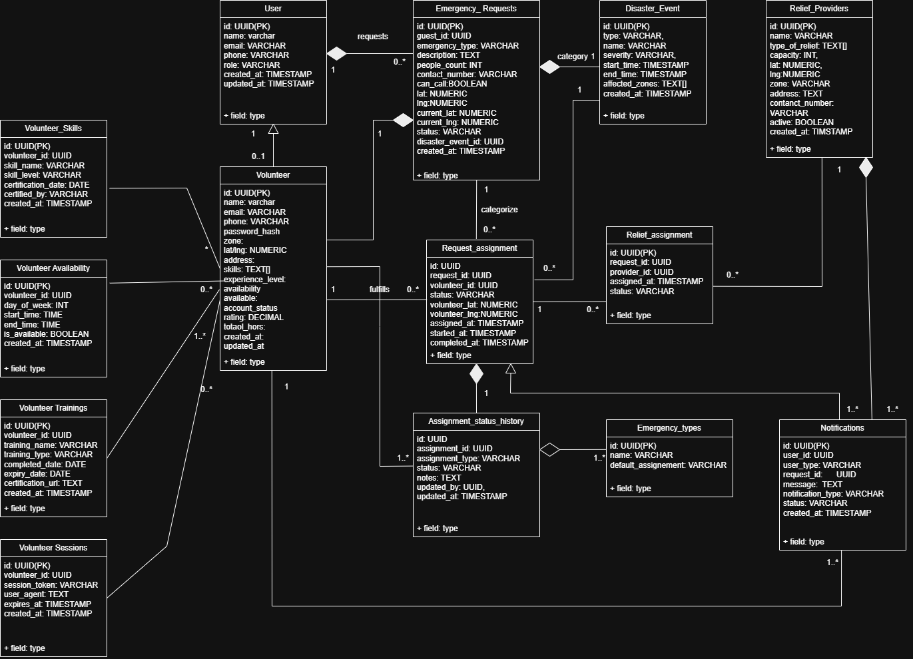

# RescueLink

RescueLink is a web platform that connects people in emergencies with nearby volunteers and NGOs in real time — aiming to reduce response time and improve rescue coordination when every second counts.

## 🚨 Features

- Users can request help and share their live location  
- Volunteers can view nearby emergency requests  
- NGOs can manage shelters and coordinate resources  
- Live emergency overview with alerts and updates  
- Real-time matching between citizens and responders  

## 🛠 Tech Stack

**Frontend:** React.js  
**Backend:** Node.js & Express.js  
**Database:** PostgreSQL  
**APIs:** REST APIs for request handling and coordination  

## Domain Model


## 📦 Project Structure

```text
RescueLink/
├── frontend/     # React app (UI & client logic)
├── backend/      # Express API (server & database)
└── README.md     # Project documentation
```


## 🚀 Getting Started

### Clone the Repository

```bash
git clone https://github.com/AnvithaYalamanchili/RescueLink.git
cd RescueLink

Frontend Setup
cd frontend
npm install
npm start

Backend Setup
cd backend
npm install
node server.js
```
Make sure you have PostgreSQL installed and configured. Create a database and update your .env with credentials.

### What’s in Progress

- API structure and routing
- Database schema design
- Role‑based authentication
- Live request tracking and notifications
